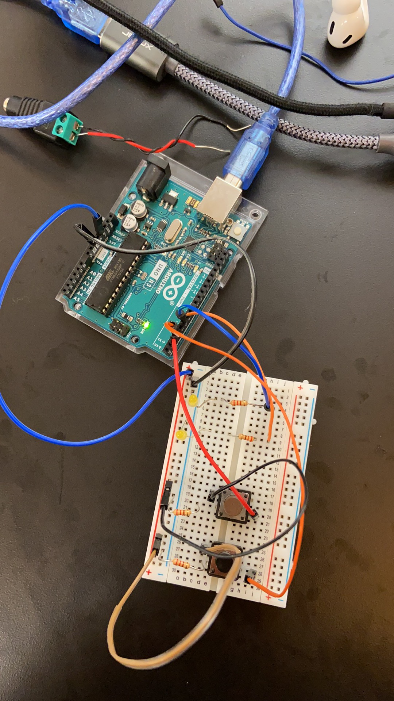

## Interruptible LED fade

Create a fading LED attached to a microcontroller. Your LED should be interruptible by either a pushbutton, analog input, or serial input. Your fade speed and fade curve are yours to determine. Don’t use programmable LEDs for this, keep it simple and use a single-channel source. Either fade an LED directly from your microcontroller, or use a DC source.

<video src="https://user-images.githubusercontent.com/51350490/220411780-440c2664-e26b-4f01-be05-fa12f8d41e1b.mp4">
</video>

In this assignment, I used both the simple linear curve and the exponential curve for the fade. The LED on the top of the video is the exponential curve fade and the bottom is the simple linear curve fade. As the video shows, the two types of fades are different.
The button on the top (brown) gradually turns the lights on, and the bottom turns the lights off. When both buttons are pressed at the same time, the bulbs show a loop where the two bulbs flash with the fade on to off and back to on.

